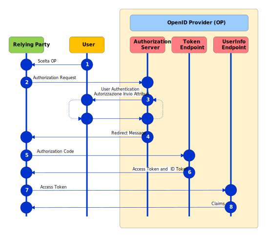

.. include:: ../common/common_definitions.rst

.. _flusso_autenticazione:

Flusso di autenticazione
------------------------

Gli schemi di autenticazioni **"Entra con SPID"** e **"Entra con CIE"** implementano il flusso **OpenID Connect Authorization Code Flow** con l'estensione **PKCE** (Proof Key for Code Exchange, :rfc:`7636`).
Questo flusso restituisce un **Authorization Code** che può essere utilizzato per ottenere un **ID Token**
e un **Access Token** e se possibile anche un **Refresh Token**. 
L'**Authorization Code Flow** ottiene l'**Authorization Code** dall'*Authorization Endpoint* dell'OpenID Provider e tutti i token sono restituiti dal **Token Endpoint**.

Segue la descrizione dei passaggi, come da numerazione indicata in figura.

  #. L'Utente, nella pagina di accesso del Relying Party (RP):

     * Seleziona il pulsante "Entra con SPID" o "Entra con CIE";
     
     * Nel caso SPID, seleziona l'OP con cui autenticarsi.   

  #. Il RP prepara una Richiesta di Autorizzazione con i parametri necessari previsti da *PKCE* e la invia all'*Authorization Endpoint* dell'OP.

  #. L'OP autentica l'utente mediante l'inserimento delle credenziali e ottiene il consenso per l'accesso agli attributi dell'utente da parte del RP.

  #. L'OP reindirizza l'utente all'URL contenuto nel parametro *redirect_uri* specificato dal RP, passando un *Authorization Code* nell'Authorization Response.

  #. Il RP invia l'*Authorization Code* ricevuto al *Token Endpoint* dell'OP.

  #. Il *Token Endpoint* dell'OP rilascia un **ID Token**, un **Access Token** e se previsto un **Refresh Token**.

  #. Il RP riceve e valida l'**Access Token** e l'**ID Token**. Per chiedere gli attributi che erano stati autorizzati dall'utente al punto 3, invia una richiesta all'*UserInfo Endpoint* dell'OP utilizzando l'**Access Token** per l'autenticazione all'interno della intestazione HTTP Authorization.

  #. Lo *UserInfo Endpoint* dell'OP verifica la validità dell'**Access Token** e rilascia gli attributi richiesti al RP.

.. note::
  **PKCE** è un'estensione del protocollo *OAuth 2.0* prevista anche nel profilo *iGov* (`International Government Assurance Profile for OAuth 2.0 <https://openid.net/specs/openid-igov-oauth2-1_0-03.html#rfc.section.3.1.7>`_) e finalizzata ad evitare un potenziale attacco attuato con l'intercettazione dell'*authorization code*. Consiste nella generazione di un codice (**code verifier**) e del suo hash (**code challenge**). Il **code challenge** viene inviato all'OP nella richiesta di autenticazione. 
  
  Quando il RP contatta il *Token Endpoint* al termine del flusso di autenticazione, invia il **code verifier** originariamente creato, in modo che l'OP possa confrontare che il suo hash corrisponda con quello acquisito nella richiesta di autenticazione.

  Di seguito un script Python di esempio per generare i parametri richiesti.

  .. literalinclude :: ../../static/pkce.py
   :language: python

