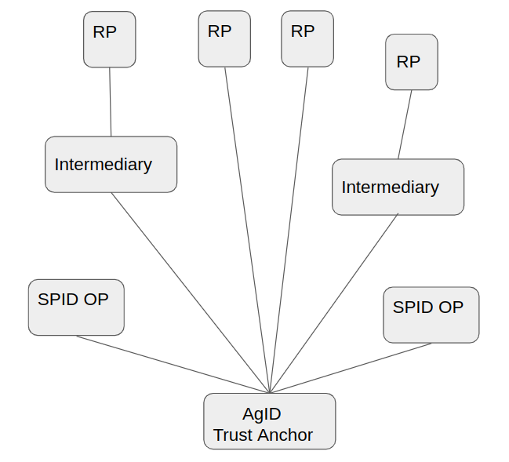
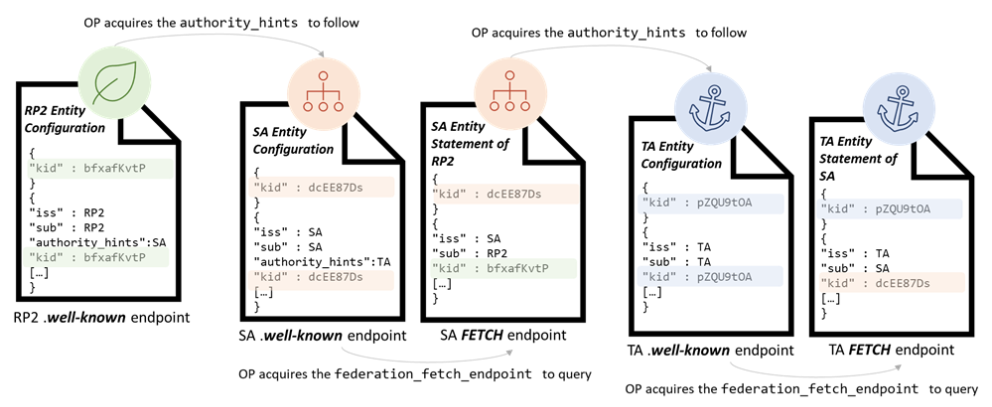
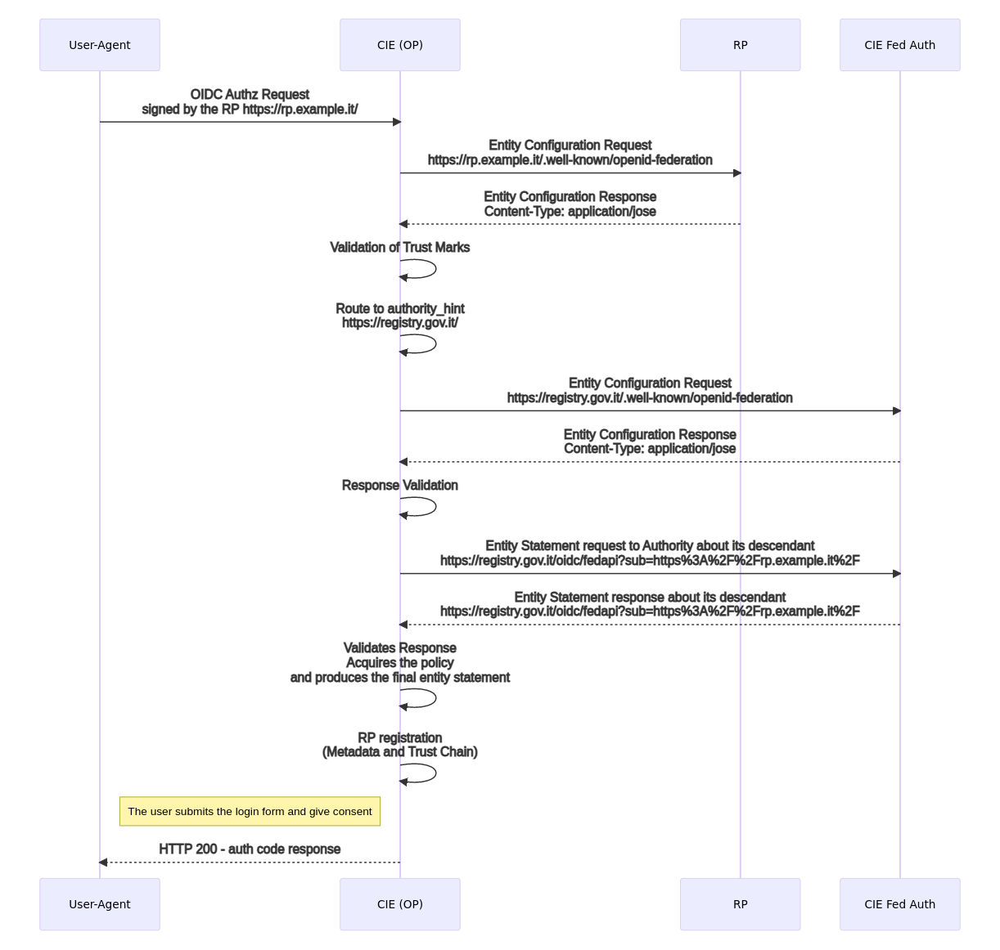
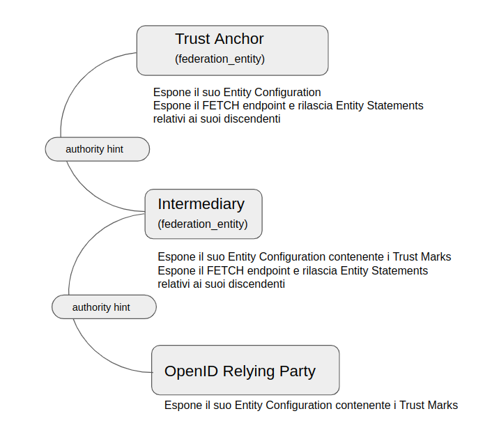

.. include:: ./common_definitions.rst

La Federazione SPID e CIE id
============================

Che cos'è una Federazione
-------------------------

Affinché le parti si riconoscano all’interno della medesima Federazione delle identità è necessario che ognuna di queste ottenga la prova della reciproca aderenza ad un medesimo quadro regolatorio. Le parti ottengono i metadati gli uni degli altri,  contenenti le chiavi pubbliche per le operazioni di firma digitale e criptazione e le definizioni necessarie all'interscambio delle informazioni, secondo le regole prestabilite.

SPID adotta le specifiche di OpenID Connect (OIDC) Federation 1.0 `[OIDC-FED]`_ che definiscono come le entità, intese come partecipanti ad una Federazione, possono riconoscersi ed ottenere i metadati di Federazione e i metadati per il protocollo OpenID Connect `[OpenID.Core]`_. I metadati sono certificabili da un parte fidata che all’interno della Federazione SPID è AgID e corrisponde alla Autorità di Federazione.

SPID implementa OpenID Connect Federation 1.0 ed estende alcune funzionalità dello standard, ne realizza una implementazione concreta e produce le buone pratiche per la sua adozione. Per approfondimenti allo standard si rimanda alle specifiche ufficiali `[OIDC-FED]`_ e alla sezione “Differenze con OIDC Federation 1.0”. 

Entità della Federazione
------------------------

Le parti coinvolte all’interno di una Federazione OpenID Connect sono le seguenti:

.. list-table:: 
   :widths: 25 75
   :header-rows: 0

   * - **Autorità di Federazione**
     - Agenzia per l'Italia Digitale (AgID). Norma il funzionamento e le modalità di registrazione e riconoscimento dei partecipanti.
   * - **Trust Anchor**
     - Sistema gestito dalla AgID il cui compito è quello di pubblicare la configurazione della Federazione e le affermazioni di riconoscimento delle parti che afferiscono alla Federazione. Il Trust Anchor corrisponde alla Autorità di Federazione e rappresenta la Federazione stessa.
   * - **Intermediario**
     - Soggetto Aggregatore (SA), facilita l'ingresso nella Federazione e PUÒ gestire le funzionalità per conto di un suo discendente (Aggregato), pubblica la propria configurazione all’interno della Federazione e le affermazioni di riconoscimento delle parti sue discendenti (Aggregati) in conformità alle regole definite dalla AgID.
   * - **Foglia**
     - Entità definita dal protocollo OIDC come Relying Party e Provider OpenID.
   * - **Entità**
     - Partecipante alla Federazione. Trust Anchor, Intermediario o Foglia.

Configurazione della Federazione SPID
-------------------------------------

La configurazione della Federazione SPID è pubblicata dal Trust Anchor all'interno della sua :ref:`Entity Configuration<Esempio_EN1.4>`, presso un web path ben noto e corrispondente a **.well-known/openid-federation**.

Tutti i partecipanti DEVONO ottenere prima della fase di esercizio la configurazione della Federazione e mantenere questa aggiornata su base giornaliera. All’interno della Configurazione della Federazione è presente la chiave pubblica del Trust Anchor usata per le operazioni di firma, il numero massimo di Intermediari consentiti tra una Foglia e il Trust Anchor (**max_path length**) e le autorità abilitate all’emissione dei Trust Marks (**trust_marks_issuers**).

Si veda la Sezione dedicata alle :ref:`Entity Configuration<Entity_Configuration>` per ulteriori dettagli.

Modalità di partecipazione alla Federazione
-------------------------------------------

Per aderire alla Federazione SPID una entità di tipo Foglia deve pubblicare la propria configurazione (Entity Configuration) presso il web endpoint :ref:`.well-known/openid-federation<Esempio_EN1>`.

Gli incaricati tecnici ed amministrativi della Foglia completano la procedura amministrativa per la registrazione di una nuova entità o l’aggiornamento di una preesistente definita dalla Autorità di Federazione o da un suo Intermediario (SA).

L’Autorità di Federazione o suo Intermediario dopo aver effettuato tutti i controlli amministrativi e tecnici richiesti, registra le chiavi pubbliche della Foglia e rilascia una prova di adesione alla Federazione sotto forma di Trust Mark (TM).

La Foglia DEVE includere il TM all’interno della propria configurazione di Federazione (Entity Configuration) come prova del buon esito del processo di onboarding. 

L’Autorità di Federazione o suo Intermediario DEVE pubblicare la dichiarazione di riconoscimento della Foglia (Entity Statement) contenente le chiavi pubbliche di federazione della Foglia e i TM a questa rilasciati. L’Autorità di Federazione o suo Intermediario PUÒ pubblicare una politica dei `metadata <https://openid.net/specs/openid-connect-federation-1_0.html#rfc.section.5.1>`_ per forzare la modifica dei metadata OIDC della Foglia, nelle parti in cui questo fosse necessario.

*Schema ad albero che rappresenta la struttura della Federazione. Alla Base l’Autorità di Federazione e a salire gli OP che non hanno intermediari, gli RP e gli Intermediari che a loro volta Aggregano altri RP.*

Modalità di riconoscimento e instaurazione della fiducia tra le parti
---------------------------------------------------------------------

In questa sezione vi sono illustrate le modalità di mutuo riconoscimento tra RP e OP, le modalità con le quali le Foglie della Federazione SPID si riconoscono all’interno della medesima Federazione e ottengono gli uni i metadata degli altri.

Relying Party
-------------

Il RP ottiene la lista degli OP in formato JSON interrogando l’:ref:`endpoint list<Entity_Listing_endpoint>` disponibile presso il :ref:`Trust Anchor<Esempio_EN3>`. Per ogni soggetto contenuto nella :ref:`risposta<Esempio_EN3.1>` dell’endpoint list e corrispondente ad un OP, il RP :ref:`richiede<Esempio_EN2>` ed ottiene l’Entity Configuration self-signed presso l’OP. 

Per ogni EC degli OP, il RP verifica la firma del contenuto adoperando la chiave pubblica ottenuta dall’Entity Statement rilasciato dalla Trust Anchor. Verificata la firma dell’Entity Configuration con la chiave pubblica pubblicata dalla Trust Anchor la fiducia è stabilita nei confronti del OP da parte del RP. 

Il RP applica infine le politiche pubblicate dal Trust Anchor sui metadata del OP e salva il metadata finale associandolo ad una data di scadenza (**claim exp**). La data di scadenza corrisponde al valore di **exp** più basso ottenuto da tutti gli statement che compongono la **Trust Chain**. Periodicamente il RP aggiorna i metadati di tutti gli OP rinnovando la Trust Chain relativa a questi.

Ottenuti i metadati finali di tutti i Provider SPID, il RP genera lo SPID Button e lo pubblica all’interno della pagina di autenticazione destinata agli utenti.

La procedura di Metadata Discovery risulta semplificata per i RP SPID perché non è consentita all’interno della Federazione l’esistenza di Intermediari tra gli OP ed il loro Trust Anchor

*La procedura di Metadata Discovery a partire dalla Foglia fino al Trust Anchor. Si noti come dall’Entity Statement rilasciato da un superiore si ottiene la chiave pubblica per la validazione dell’Entity Configuration dell’entità discendente.*

OpenID Provider
---------------

Quando un Provider (OP) riceve una richiesta di autorizzazione da parte di un RP non precedentemente riconosciuto avviene la procedura di **automatic client registration**. Sono di seguito descritte le operazioni compiute dal OP per registrare un RP dinamicamente.

*La registrazione di un RP dalla prospettiva di un OP che per la prima volta riceve una richiesta di autorizzazione dal RP e avvia il processo di Metadata Discovery e salvataggio della Trust Chain.*

L’OP estrae l’identificativo univoco (**client_id**) dall’oggetto *request* contenuto all’interno della *Authorization Request* ed effettua una richiesta di Entity Configuration presso il :ref:`RP<Esempio_EN1.1>`. Ottiene la configurazione *self-signed* del RP e convalida la firma dei Trust Marks riconoscibili all’interno della Federazione [1]_. 

Se il RP non espone all’interno della sua configurazione nessun Trust Mark riconoscibile per il profilo di RP (vedi Sezione :ref:`Trust Mark<Trust_Mark>`) il Provider DEVE rifiutare l’autorizzazione con un messaggio di errore di tipo *unauthorized_client* conforme alla Linee Guida OpenID Connect SPID. 

Se il Provider convalida con successo almeno un Trust Mark per il profilo RP contenuto all’interno della configurazione del RP richiedente, estrae le entità superiori contenute nel claim **authority_hints** ed avvia la fase di Metadata Discovery. Ne consegue il calcolo della **Trust Chain** e l’ottenimento del metadata finale.

Durante il Metadata Discovery, il Provider richiede ad una o più di una entità superiore [2]_ l’Entity Statement relativo al RP e ottiene la chiave pubblica con la quale valida la configurazione del RP, fino a giungere al Trust Anchor. Infine applica la politica dei metadata pubblicata dal Trust Anchor e salva il risultante metadata finale del RP associandolo ad una data di scadenza, oltre la quale rinnoverà il metadata secondo le modalità di rinnovo della Trust Chain.

Ottenuto il metadata finale, il Provider valida la richiesta del RP secondo le modalità definite all’interno delle Linee Guida OpenID Connect SPID. 

Nei casi in cui un RP avesse come entità superiore un SA e non direttamente la TA, la procedura di acquisizione e validazione dell’Entity Configuration del RP avviene mediante l’Entity Statement pubblicato dal SA nei confronti del RP e mediante la convalida dell’Entity Configuration del SA con l’Entity Statement emesso dalla TA in relazione al SA. Se la soglia del massimo numero di intermediari verticali, definita dal valore di **max_path_length**, venisse superata, l’OP blocca il processo di Metadata Discovery e rigetta la richiesta del RP.

.. [1] I Trust Mark di Federazione sono configurati nel claim **trust_marks_issuers** e contenuti nell’Entity Configuration del Trust Anchor.

.. [2] Un RP può esporre più di una entità superiore all’interno del proprio claim di **authority_hints**. Si pensi ad un RP che partecipa sia alla Federazione SPID che a quella CIE. Inoltre un RP può risultare come aggregato di molteplici intermediari, se questi SPID o CIE.

*Ogni partecipante espone la propria configurazione e i propri Trust Mark. Il collegamento tra una Foglia e il Trust Anchor avviene in maniera diretta oppure mediante un Intermediario (Soggetto Aggregatore) come in Figura.*

Modalità di accesso alla Entity Configuration
---------------------------------------------

In questa sezione viene descritto come individuare per un determinato soggetto  l’URL `[RFC3986]`_ per il download della Entity Configuration. 

La risorsa attraverso la quale un partecipante pubblica la sua configurazione (Entity Configuration) corrisponde al webpath **.well-known/openid-federation** e DEVE essere appesa all’URL che identifica il soggetto.

Esempi:

 - con identificativo del soggetto pari a **https://rp.example.it** il risultante URL di Entity Configuration è  **https://rp.example.it/.well-known/oidc-federation**.
 - con identificativo del soggetto pari **https://rp.servizi-spid.it/oidc/** il risultante URL di Entity Configuration è **https://rp.servizi-spid.it/oidc/.well-known/oidc-federation**.

Se l’URL che identifica il soggetto non presenta il simbolo di slash finale (“/”) è necessario aggiungerlo prima di appendere il web path della risorsa **well-known**.

.. _Trust_Mark:

Trust Mark
----------

I Trust Mark, letteralmente tradotti come marchi di fiducia, sono oggetti JSON firmati in formato Jose `[RFC7515]`_ e rappresentano la dichiarazione di conformità a un insieme ben definito di requisiti di fiducia e/o di interoperabilità o un accordo tra le parti coinvolte all’interno della Federazione. I Trust Marks sono rilasciati principalmente durante il processo di registrazione di una nuova entità di tipo Foglia (onboarding) dal Trust Anchor o suoi Intermediari.

Lo scopo principale di questi marchi di fiducia è quello di esporre alcune informazioni non richieste dal protocollo OpenID Connect Core ma che risultano utili in contesto Federativo.

Esempi tipici includono il codice di identificazione nazionale o internazionale dell'entità [3]_, i contatti istituzionali e altro. Ulteriori dati possono essere aggiunti dall'emittente se resi comprensibili all’interno della Federazione.

I Trust Marks riconoscibili all’interno della Federazione SPID sono emessi e firmati dalla AgID (TA) o suoi intermediari (SA) o dai Gestori di attributi qualificati (AA) se definiti all’interno del claim **trust_mark_issuers** pubblicato all’interno dell’Entity Configuration del TA. Ogni partecipante DEVE esporre nella propria configurazione (EC) i Trust Mark rilasciati dalle autorità emittenti. 

I Trust Mark rappresentano il primo filtro per l'instaurazione della fiducia tra le parti, sono elementi indispensabili per avviare la risoluzione dei metadati. *In loro assenza una entità non è riconoscibile come partecipante all’interno della Federazione SPID.*

All’interno della Federazione SPID i Trust Mark presentano degli identificativi univoci in formato URL che adottano la seguente struttura:

<domain> / <entity_type> / <trustmark_profile> /

Alcuni esempi non normativi sono di seguito riportati:

profilo RP public: https://registry.agid.gov.it/openid_relying_party/public/
profilo SA private: https://registry.agid.gov.it/federation_entity/private/

.. [3] Codice Fiscale, IPA Code, Partita IVA, VAT Number, etc.

Validazione dei Trust Mark
++++++++++++++++++++++++++

Esistono due modi per validare un Trust Mark:

 1. Validazione **statica**. Il Trust Mark viene validato mediante il certificato pubblico dell’autorità che lo ha emesso (claim **iss**), sulla base della corrispondenza del claim **sub** con il medesimo claim della Entity Configuration in cui è contenuto e sulla base del valore di scadenza (claim **exp**).

 2. Validazione **dinamica**. I partecipanti della federazione possono interrogare l'endpoint :ref:`trust mark status<Trust_mark_status_endpoint>` erogato dal suo emittente (claim iss) per la verifica in tempo reale dei TM da lui emessi. 

Tutti gli emittenti di Trust Mark DEVONO esporre un endpoint di trust mark status per consentire la validazione **dinamica**.

Revoca dei Trust Mark
+++++++++++++++++++++

Un Trust Mark può essere revocato in qualsiasi momento. In caso di esclusione di un Soggetto Aggregato da parte della Autorità di Federazione, questa comunica al Soggetto Aggregatore l’esclusione dell'Aggregato. Di conseguenza il SA revoca il TM per il suo discendente.

Pubblicazione dei Trust Marks
+++++++++++++++++++++++++++++

La TA definisce i TM e gli emittenti di questi abilitati nella Federazione mediante il claim **trust_mark_issuers**, presente all’interno del proprio Entity Configuration. Il valore del claim **trust_mark_issuers** è composto da un oggetto JSON, avente come chiavi gli id dei TM e come valori la lista degli emittenti abilitati.

Di seguito un esempio non normativo dell’oggetto **trust_mark_issuers** all’interno della Entity Configuration del TA.

.. code-block::

 "trust_marks_issuers":{
      "https://registry.agid.gov.it/openid_relying_party/public/":[
         "https://registry.spid.agid.gov.it/",
         "https://public.intermediary.spid.it/"
      ],
      "https://registry.agid.gov.it/openid_relying_party/private/":[
         "https://registry.spid.agid.gov.it/",
         "https://private.other.intermediary.it/"
      ]
   }

I TM emessi per le Foglie DEVONO essere pubblicati dalle stesse all’interno della proprie Entity Configuration, all’interno del claim **trust_marks**. Questo è composto da lista di oggetti JSON, ognuno di questi DEVE contenere almeno i claim **id** e **trust_mark**, il primo identifica il TM, il secondo contiene il JWT firmato del TM.

Di seguito un esempio non normativo dell’oggetto **trust_marks** all’interno della Entity Configuration di una Foglia di tipo RP.

.. code-block::

 "trust_marks": [
    {
      "id": "https://www.spid.gov.it/openid-federation/agreement/sp-public/", 
      "trust_mark": …
    }
 ]

Composizione dei Trust Mark 
+++++++++++++++++++++++++++

I claim definiti all’interno dei Trust Marks aderiscono a quanto definito all’interno dello standard OIDC Federation 1.0 [4]_. Questi sono di seguito riportati.

.. list-table::
    :widths: 20 20 60
    :header-rows: 1

    * - **Claim**
      - **Tipo**
      - **Descrizione**
    * - **iss**
      - String
      - RICHIESTO. URL che identifica univocamente l’Autorità che lo ha emesso.
    * - **sub**
      - String
      - RICHIESTO. URL che identifica univocamente il soggetto per il quale il Trust Mark è stato emesso.
    * - **id**
      - String
      - RICHIESTO. Identificativo univoco del Trust Mark.
    * - **iat**
      - UTC Timestamp
      - RICHIESTO. Quando è stato emesso questo marchio di fiducia. Espresso come “Seconds Since the Epoch” `[RFC7519]`_.
    * - **logo_uri**
      - String
      - OPZIONALE. Un URL che punta al logo rappresentante il Trust Mark.
    * - **exp**
      - UTC Timestamp
      - RICHIESTO. Momento oltre il quale non sarà più valido. Espresso come “Seconds Since the Epoch” `[RFC7519]`_ e corrispondente o inferiore alla durata della validità della convenzione amministrativa di adesione alla Federazione.
    * - **ref**
      - String
      - OPZIONALE. URL che punta a informazioni presenti sul web relative a questo marchio di fiducia

La seguente tabella riassume tutti i profili supportati per le entità di tipo RP coinvolte nella Federazione SPID.

.. list-table::
    :widths: 20 60 20
    :header-rows: 1

    * - **Tipo**
      - **Descrizione**
      - **Entità**
    * - **public**
      - Indica che il RP afferisce ad una Pubblica Amministrazione.
      - All
    * - **private**
      - Indica che il RP afferisce ad una Pubblica Amministrazione.
      - All

Agli attributi dei TM definiti nella tabella precedente, i Trust Mark SPID aggiungono i seguenti.

.. list-table::
    :widths: 30 70 
    :header-rows: 1

    * - **Claims**
      - **Description**
    * - **organization_type**
      - RICHIESTO. Specifica se l'ente appartiene alla pubblica amministrazione italiana o al settore privato (private or public).
    * - **id_code**
      - RICHIESTO. Codice di identificazione dell'organizzazione; a seconda del valore del tipo di organizzazione deve essere indicato il codice IPA (per il tipo di organizzazione pubblica) o il numero di partita IVA (per quello privato).
    * - **email**
      - RICHIESTO. Email istituzionale o PEC dell'organizzazione.
    * - **organization_name**
      - RICHIESTO. Il nome completo dell'entità che fornisce i servizi

.. [4] Al momento della pubblicazione di questo documento OIDC Federation 1.0 è giunto al DRAFT 18

Quello che segue è un esempio non normativo di un marchio di fiducia emesso da AgID per un intermediario privato.

.. code-block::

 "trust_marks": [
  {
   "id":"https://registry.agid.gov.it/federation_entity/private/",
   "trust_mark": …
  }
 ]

Dove il contenuto del JWT firmato all’interno del claim **trust_mark** corrisponde a:

.. code-block::

 {
   "id":"https://registry.agid.gov.it/federation_entity/private/",
   "iss": "https://registry.agid.gov.it",
   "sub": "https://intermediary.example.it",
   "iat": 1579621160,
   "organization_type": "private",
   "id_code": "12345678900",
   "email": "email_or_pec@example.it",
   "organization_name": "Full name of the SA",
   "ref": "https://reference_to_some_documentation.example.it/"
 }

Un'entità intermediaria (SA) è riconoscibile come emittente di Trust Mark. Quello che segue è un esempio non normativo di un Trust Mark emesso da un Soggetto Aggregatore a favore di un RP suo discendente.

.. code-block::

 "trust_marks": [
  {
   "id":"https://registry.agid.gov.it/openid_relying_party/public/",
   "trust_mark": …
   }
 ]

Dove il contenuto del JWT firmato all’interno del claim **trust_mark** corrisponde al seguente esempio non normativo.

.. code-block::

 {
   "id":"https://registry.agid.gov.it/openid_relying_party/public/",
   "iss": "https://intermediary.example.it",
   "sub": "https://rp.example.it",
   "iat": 1579621160,
   "organization_type": "public",
   "id_code": "123456",
   "email": "email_or_pec@rp.it",
   "organization_name": "Full name of the RP",
   "ref": "https://reference_to_some_documentation.it/"
 }

.. _Entity_Configuration:

Entity Statement e Configuration
--------------------------------

Un Entity Configuration è un metadata di federazione in formato Jose e firmato dal soggetto che lo emette e riguardante se stesso, all’interno del quale i valori dei claim **iss** e **sub** contengono il medesimo valore (URL).

Un Entity Statement è un documento di riconoscimento che una Autorità di Federazione o suo Intermediario emette per uno specifico soggetto, suo discendente, individuato all’interno del claim **sub**.

Firma
+++++

La firma dei JWT `[RFC7515]`_ avviene mediante l'algoritmo RSA SHA-256 (RS256), tutti i partecipanti DEVONO supportare questo algoritmo di firma all’interno della Federazione. Tutte le operazioni di firma relative agli Entity Statements, Entity Configuration e Trust Mark sono condotte con le chiavi pubbliche di Federazione [5]_.

Attributi (claim)
+++++++++++++++++

Entity Configuration e Statement presentano i seguenti claim comuni:

.. list-table::
    :widths: 20 20 60
    :header-rows: 1

    * - **Nome**
      - **Tipo**
      - **Descrizione**
    * - **iss**
      - String
      - RICHIESTO. Identificativo dell'entità che lo emette. 
    * - **sub**
      - String
      - RICHIESTO. Identificativo del soggetto a cui è riferito. 
    * - **iat**
      - UTC Timestamp
      - RICHIESTO. Data di emissione. 
    * - **exp**
      - UTC Timestamp
      - RICHIESTO. Data di scadenza.
    * - **jwks**
      - JWKS
      - RICHIESTO. Un JSON Web Key Set (JWKS) `[RFC7517]`_ che rappresenta la parte pubblica delle chiavi di firma dell'entità interessata. Ogni JWK nel set JWK DEVE avere un ID chiave (claim kid).
    * - **trust_marks**
      - JSON array
      - RICHIESTO per tutti i partecipanti fatta esclusione del Trust Anchor. Un array JSON contenente i Trust Mark. Vedere la Sezione :ref:`Trust Mark <Trust_Mark>`.

.. [5] Distinguiamo le chiavi  di Federazione da quelle di OIDC Core, questi ultimi risiedono nei metadata OIDC. Un Entity Statement o Configuration contiene sia le chiavi pubbliche di Federazione che i metadata OIDC.

Gli oggetti Entity Configuration delle Entità di tipo Foglia contengono in aggiunta ai claim comuni anche i seguenti:

.. list-table::
    :widths: 10 10 80
    :header-rows: 1

    * - **Nome**
      - **Tipo**
      - **Descrizione**
    * - **authority_hints**
      - Array di URLs
      - RICHIESTO. Contiene una lista di URL delle entità superiori, quali TA o SA che POSSONO emettere un Entity Statement relativo a questo soggetto. 
    * - **metadata**
      - JSON object
      - RICHIESTO. Ogni chiave dell'oggetto JSON rappresenta un identificatore del tipo di metadati e ogni valore DEVE essere un oggetto JSON che rappresenta i metadati secondo lo schema di metadati di quel tipo. 

        Una configurazione di entità PUÒ contenere più dichiarazioni di metadati, ma solo una per ogni tipo di metadati (<**entity_type**>). 

        I tipi consentiti sono i seguenti:

        - openid_relying_party
        - openid_provider
        - federation_entity
        - oauth_resource
        - trust_mark_issue
 

Gli oggetti Entity Configuration della Federation Authority che è AgID, contiene in aggiunta ai claim comuni anche i seguenti:

.. list-table::
    :widths: 20 10 70
    :header-rows: 1

    * - **Nome**
      - **Tipo**
      - **Descrizione**
    * - **constraints**
      - JSON object
      - RICHIESTO e include l’elemento max_path_length al quale viene assegnato un valore Integer. 
        
        Indica il numero massimo di intermediari consentiti tra una Foglia e il suo Trust Anchor.
    * - **trust_marks_issuers**
      - JSON array
      - RICHIESTO. Indica quali autorità sono considerate attendibili nella federazione per l’emissione di specifici Trust Mark, questi assegnati mediante il proprio identificativo univoco.

Gli Entity Statement emessi dal Trust Ancor o suo Intermediario per i propri diretti discendenti, contengono in aggiunta ai claim comuni anche i seguenti:

.. list-table::
    :widths: 20 10 70
    :header-rows: 1

    * - **Nome**
      - **Tipo**
      - **Descrizione**
    * - **metadata_policy**
      - JSON object
      - OPZIONALE. Oggetto JSON che descrive un criterio di metadati. Ogni chiave dell'oggetto JSON rappresenta un identificatore del tipo di metadati e ogni valore DEVE essere un oggetto JSON che rappresenta la politica dei metadati in base allo schema di quel tipo di metadati. Si rimanda alla specifica `[OIDC-FED#Section.5.1]`_ per i dettagli implementativi.
    * - **trust_marks**
      - JSON array
      - RICHIESTO. Un array JSON contenente i Trust Mark emessi da se stesso per il soggetto discendente.

Endpoint per Trust Anchor ed Intermediari
-----------------------------------------
Il Trust Anchor e i suoi Intermediari (federation_entity) DEVONO in aggiunta esporre al pubblico i seguenti endpoint:

Fetch entity statement endpoint
+++++++++++++++++++++++++++++++

Il recupero degli Entity Statement viene effettuato presso questo endpoint secondo le modalità definite all’interno di OIDC-FED “7.1. Fetching Entity Statements”.

.. _Trust_mark_status_endpoint:

Trust mark status endpoint
++++++++++++++++++++++++++

L’assegnazione di un Trust Mark ad un soggetto viene effettuato presso questo endpoint secondo le modalità definite all’interno di OIDC-FED “7.4. Trust Mark Status”.

.. _Entity_Listing_endpoint:

Entity Listing endpoint
+++++++++++++++++++++++

Per ottenere la lista dei discendenti registrati presso la TA o un suo Intermediario è possibile interrogare questo endpoint secondo le modalità descritte in OIDC-FED “7.3. Entity Listings”. Ai parametri esistenti già definiti nella specifica, si aggiunge per SPID il parametro entity_type come filtro sul tipo di entità dei discendenti (<entity-type>).

Differenze con OIDC Federation 1.0
----------------------------------

In questa sezione sono elencate le differenze che intercorrono tra lo standard ufficiale e l’implementazione SPID.

Client Registration
+++++++++++++++++++

SPID supporta esclusivamente **automatic_client_registration**. La modalità **implicit** è da intendersi come non supportata. 

Listing endpoint
++++++++++++++++

In SPID viene adottato il parametro aggiuntivo **entity_type** a quelli esistenti nello Standard [OIDC-FED] per questo endpoint, con lo scopo di ottenere un filtro sulla tipologia delle entità discendenti. Questa esigenza consente nello specifico di filtrare entità di tipo **federation_entity**, **openid_relying_party**, **openid_provider** e **oauth_resource**.

Trust Mark
++++++++++

In OIDC-FED l’uso dei Trust Mark non è obbligatorio. In SPID piuttosto l’esposizione dei Trust Mark è obbligatoria. Per approfondimenti sulla ragione dell’obbligo dei Trust Mark si rimanda alla sezione :ref:`Considerazioni di Sicurezza<Considerazioni_di_Sicurezza>`.

Claim non supportati negli Entity Statement
+++++++++++++++++++++++++++++++++++++++++++

Poiché SPID non necessita di alcun claim aggiuntivo in ambito federativo, non necessita dei claim crit. Inoltre non sono supportati i claim **aud**, **naming_constraints**, **policy_language_crit** e **trust_anchor_id**. L’eventuale presenza di questi claim non presenta alcuna implicazione, questi verranno semplicemente ignorati fino ad ulteriori avvisi che li normino.

.. _Considerazioni_di_Sicurezza:

Considerazioni di Sicurezza
---------------------------

In questa sezione descriviamo alcune considerazioni di sicurezza in ambito OIDC Federation.

Trust Mark come deterrente contro gli abusi
+++++++++++++++++++++++++++++++++++++++++++

L’implementazione dei Trust Mark e il filtro su questi in fase di Metadata Discovery risulta necessario contro gli attacchi destinati al consumo delle risorse. Un OP attaccato con un numero ingente di connessioni presso il suo endpoint di *authorization*, contenenti **client_id** e **authority_hints** fasulli, produrrebbe svariate connessioni verso sistemi di terze parti nel tentativo di trovare un percorso verso la TA e instaurare la fiducia con il richiedente.

L’OP DEVE validare staticamente il TM oppure DEVE escludere a priori la richiesta ove il TM non risultasse presente, in caso di assenza o non validità di un TM la procedura di Metadata Discovery NON DEVE essere avviata e NON DEVE creare di conseguenza connessioni verso sistemi di terze parti.

Numero Massimo di authority_hints
+++++++++++++++++++++++++++++++++

All’interno di una Federazione il Trust Anchor decide quante intermediazioni consentire tra di lui e le Foglie, mediante la constraint denominata **max_path_lenght**. Questo tipo di relazione è di tipo verticale, dalla foglia alla radice. Questo attributo se valorizzato ad esempio con un valore numerico intero pari a 1 indica che soltanto un SA è consentito tra una Foglia e il TA.

Ogni Foglia DEVE pubblicare i suoi superiori all’interno della lista contenuta nel claim **authority_hints**. Una Foglia all’interno della Federazione PUÒ avere superiori afferenti a diverse Federazioni, si pensi a CIE id per esempio. L’analisi dei superiori disponibili introduce un modello di navigazione orizzontale, ad esempio un OP tenta di trovare il percorso più breve verso il Trust Anchor attraverso tutti gli URL contenuti all’interno dell’array **authority_hints** prima di fare un ulteriore movimento verticale, a salire, verso uno degli Intermediari presenti in questo array.

La soglia **max_path_lenght** si applica per la navigazione verticale e superata questa soglia senza aver trovato il TA la procedura di Metadata Discovery DEVE essere interrotta. Si faccia l’esempio di un RP discendente di un 1 SA che quest’ultimo a sua volta è discendente di  un altro SA, essendo il valore di **max_path_lenght** pari a uno e superata questa soglia senza aver trovato il Trust Anchor, la procedura DEVE essere interrotta.

Allo stesso tempo la specifica OIDC Federation 1.0 non definisce un limite per il numero di **authority_hints**, questo perché nessun Trust Anchor può limitare il numero di Federazioni alle quali un partecipante può aderire. Per questa ragione è utile che gli implementatori adottino un limite massimo del numero di elementi consentiti all’interno dell’Array authority_hint. Questo per evitare che un numero esagerato di URL contenuti nella lista di **authority_hints**, dovuto ad una cattiva configurazione di una Foglia, produca un consumo di risorse eccessivo.

Resolve Entity Statement
++++++++++++++++++++++++

Questo endpoint DEVE rilasciare i metadata, i Trust Marks e la Trust Chain già precedentemente elaborata e NON DEVE innescare una procedura di Metadata Discovery ad ogni richiesta pervenuta, a meno che questo endpoint non venga protetto con un meccanismo di autenticazione dei client, come ad esempio private_key_jwt `[SPID-OIDC-CORE]`_.

Buone Pratiche
--------------

In questa sezione descriviamo alcune buone pratiche per ottenere la massima resa dalle entità di Federazione.

Specializzare le chiavi pubbliche OpenID Core e Federation
++++++++++++++++++++++++++++++++++++++++++++++++++++++++++

È buona pratica usare chiavi pubbliche specializzate per i due tipi di operazioni, Core e Federation.

Modalità di aggiornamento dei metadata OpenID Core
++++++++++++++++++++++++++++++++++++++++++++++++++

L’interoperabilità tra i partecipanti funziona mediante i metadata ottenuti dal calcolo e dalla conservazione delle Trust Chain. Questo significa che se un OP al tempo T calcola la Trust Chain per un RP e questo al tempo T+n modifica i propri metadata, l’OP di conseguenza potrebbe incorrere in problematiche di validazione delle richieste di autorizzazione del RP, fino a quando non avrà aggiornato la Trust Chain relativa a questo.

La buona pratica per evitare le interruzioni di servizio relative alle operazioni di OIDC Core è quella di aggiungere le nuove chiavi pubbliche all’interno degli oggetti *jwks* senza rimuovere i valori preesistenti. Oppure, ad esempio, i nuovi *redirect_uri*.

In questa maniera dopo il limite massimo di durata delle Trust Chain, definito con il claim **exp** e pubblicato nella Entity Configuration della TA, si ha la certezza che tutti i partecipanti abbiano rinnovato le loro Trust Chain, e sarà possibile agli amministratori della Foglia rimuovere le vecchie definizioni in cima alla lista.

Periodo di grazia per le Trust Chain scadute
++++++++++++++++++++++++++++++++++++++++++++

In una Federazione distribuita come quella di OIDC-FED è possibile che al tempo T+x un OP necessiti di aggiornare alcune Trust Chain, relative a diversi RP, prossime alla scadenza. Si faccia l’esempio che parte di questi RP risultino aggregati da una SA e i servizi di questo risultino temporaneamente non raggiungibili.

In questi casi, ove vi fosse l’impossibilità di aggiornare una Trust Chain a causa di irraggiungibilità dei servizi web di federazione, è possibile continuare ad utilizzare le Trust Chain scadute fino ad un massimo di 24 ore successive al primo tentativo di aggiornamento. All’interno di questo intervallo temporale “di grazia” sono comunque necessari periodici tentativi di aggiornamento.

