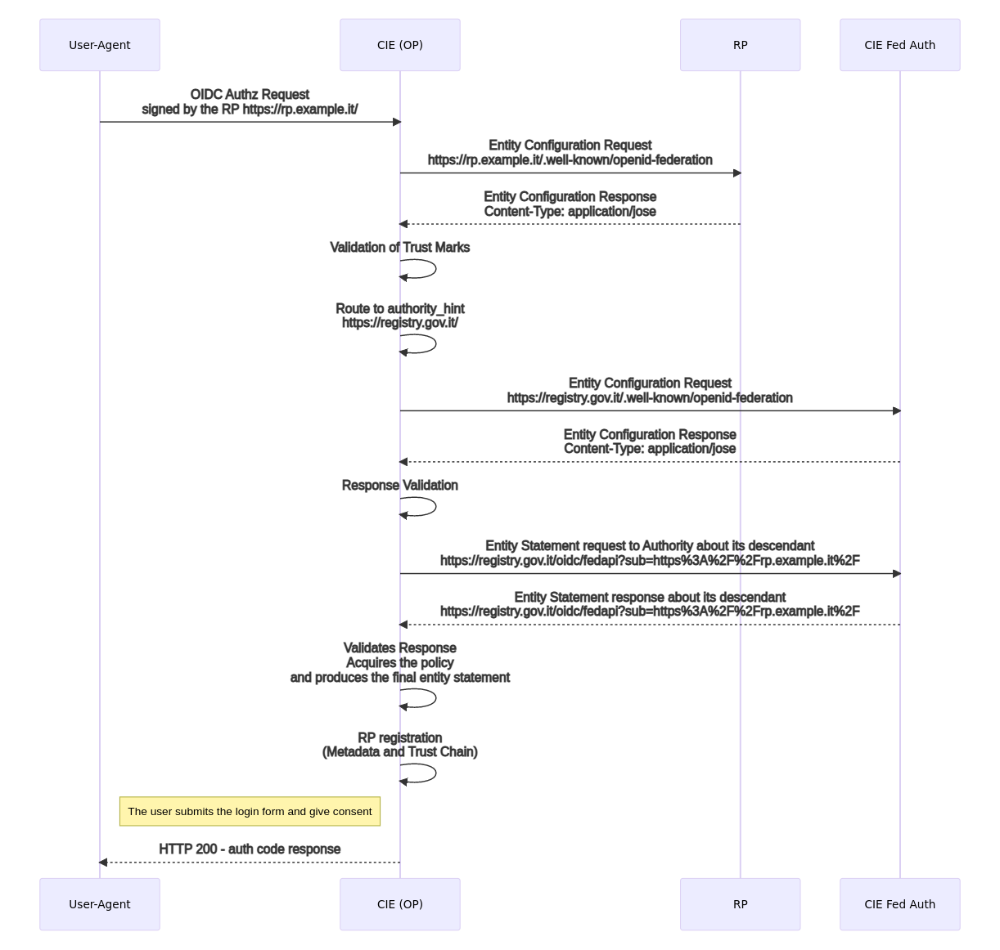

Trust negotiation
+++++++++++++++++

In questa sezione vi sono illustrate le modalità di mutuo riconoscimento tra RP e OP, le modalità con le quali le Foglie della Federazione SPID si riconoscono all’interno della medesima Federazione e ottengono gli uni i metadata degli altri.

Relying Party
++++++++++++++++++

Il RP ottiene la lista degli OP in formato JSON interrogando l’:ref:`endpoint list<Entity_Listing_endpoint>` disponibile presso il :ref:`Trust Anchor<Esempio_EN3>`. Per ogni soggetto contenuto nella :ref:`risposta<Esempio_EN3.1>` dell’endpoint list e corrispondente ad un OP, il RP :ref:`richiede<Esempio_EN2>` ed ottiene l’Entity Configuration self-signed presso l’OP. 

Per ogni EC degli OP, il RP verifica la firma del contenuto adoperando la chiave pubblica ottenuta dall’Entity Statement rilasciato dalla Trust Anchor. Verificata la firma dell’Entity Configuration con la chiave pubblica pubblicata dalla Trust Anchor la fiducia è stabilita nei confronti del OP da parte del RP. 

Il RP applica infine le politiche pubblicate dal Trust Anchor sui metadata del OP e salva il metadata finale associandolo ad una data di scadenza (**claim exp**). La data di scadenza corrisponde al valore di **exp** più basso ottenuto da tutti gli statement che compongono la **Trust Chain**. Periodicamente il RP aggiorna i metadati di tutti gli OP rinnovando la Trust Chain relativa a questi.

Ottenuti i metadati finali di tutti i Provider SPID, il RP genera lo SPID Button e lo pubblica all’interno della pagina di autenticazione destinata agli utenti.

La procedura di Metadata Discovery risulta semplificata per i RP SPID perché non è consentita all’interno della Federazione l’esistenza di Intermediari tra gli OP ed il loro Trust Anchor

.. image:: ../../images/metadata_discovery.png
    :width: 100%

*La procedura di Metadata Discovery a partire dalla Foglia fino al Trust Anchor. Si noti come dall’Entity Statement rilasciato da un superiore si ottiene la chiave pubblica per la validazione dell’Entity Configuration dell’entità discendente.*

OpenID Provider
+++++++++++++++

Quando un Provider (OP) riceve una richiesta di autorizzazione da parte di un RP non precedentemente riconosciuto avviene la procedura di **automatic client registration**. Sono di seguito descritte le operazioni compiute dal OP per registrare un RP dinamicamente.

*La registrazione di un RP dalla prospettiva di un OP che per la prima volta riceve una richiesta di autorizzazione dal RP e avvia il processo di Metadata Discovery e salvataggio della Trust Chain.*

L’OP estrae l’identificativo univoco (**client_id**) dall’oggetto *request* contenuto all’interno della *Authorization Request* ed effettua una richiesta di Entity Configuration presso il :ref:`RP<Esempio_EN1.1>`. Ottiene la configurazione *self-signed* del RP e convalida la firma dei Trust Marks riconoscibili all’interno della Federazione [1]_. 

Se il RP non espone all’interno della sua configurazione nessun Trust Mark riconoscibile per il profilo di RP (vedi Sezione :ref:`Trust Mark<Trust_Mark>`) il Provider DEVE rifiutare l’autorizzazione con un messaggio di errore di tipo *unauthorized_client* conforme alla Linee Guida OpenID Connect SPID. 

Se il Provider convalida con successo almeno un Trust Mark per il profilo RP contenuto all’interno della configurazione del RP richiedente, estrae le entità superiori contenute nel claim **authority_hints** ed avvia la fase di Metadata Discovery. Ne consegue il calcolo della **Trust Chain** e l’ottenimento del metadata finale.

Durante il Metadata Discovery, il Provider richiede ad una o più di una entità superiore [2]_ l’Entity Statement relativo al RP e ottiene la chiave pubblica con la quale valida la configurazione del RP, fino a giungere al Trust Anchor. Infine applica la politica dei metadata pubblicata dal Trust Anchor e salva il risultante metadata finale del RP associandolo ad una data di scadenza, oltre la quale rinnoverà il metadata secondo le modalità di rinnovo della Trust Chain.

Ottenuto il metadata finale, il Provider valida la richiesta del RP secondo le modalità definite all’interno delle Linee Guida OpenID Connect SPID. 

Nei casi in cui un RP avesse come entità superiore un SA e non direttamente la TA, la procedura di acquisizione e validazione dell’Entity Configuration del RP avviene mediante l’Entity Statement pubblicato dal SA nei confronti del RP e mediante la convalida dell’Entity Configuration del SA con l’Entity Statement emesso dalla TA in relazione al SA. Se la soglia del massimo numero di intermediari verticali, definita dal valore di **max_path_length**, venisse superata, l’OP blocca il processo di Metadata Discovery e rigetta la richiesta del RP.

.. [1] I Trust Mark di Federazione sono configurati nel claim **trust_marks_issuers** e contenuti nell’Entity Configuration del Trust Anchor.

.. [2] Un RP può esporre più di una entità superiore all’interno del proprio claim di **authority_hints**. Si pensi ad un RP che partecipa sia alla Federazione SPID che a quella CIE. Inoltre un RP può risultare come aggregato di molteplici intermediari, se questi SPID o CIE.

.. image:: ../../images/trust_anchor.png
    :width: 100%

*Ogni partecipante espone la propria configurazione e i propri Trust Mark. Il collegamento tra una Foglia e il Trust Anchor avviene in maniera diretta oppure mediante un Intermediario (Soggetto Aggregatore) come in Figura.*

Accesso alla Entity Configuration
+++++++++++++++++++++++++++++++++

In questa sezione viene descritto come individuare per un determinato soggetto  l’URL :rfc:`3986` per il download della Entity Configuration. 

La risorsa attraverso la quale un partecipante pubblica la sua configurazione (Entity Configuration) corrisponde al webpath **.well-known/openid-federation** e DEVE essere appesa all’URL che identifica il soggetto.

Esempi:

 - con identificativo del soggetto pari a **https://rp.example.it** il risultante URL di Entity Configuration è  **https://rp.example.it/.well-known/oidc-federation**.
 - con identificativo del soggetto pari **https://rp.servizi-spid.it/oidc/** il risultante URL di Entity Configuration è **https://rp.servizi-spid.it/oidc/.well-known/oidc-federation**.

Se l’URL che identifica il soggetto non presenta il simbolo di slash finale (“/”) è necessario aggiungerlo prima di appendere il web path della risorsa **well-known**.

Una volta che un RP viene riconosciuto come parte della Federazione CIE, ottiene il permesso di mandare una Richiesta di Autenticazione come definito in `[CIE-OIDC-CORE]`_. L'OP CIE che non riconosce l'RP che fa la richiesta, è in grado, usando CIE OIDC-FED, di risolvere correttamente la il Trust. L'OP CIE inizia richiedendo la configurazione di entità dell'RP al .well-known endpoint dell'RP e, seguendo il percorso dato dall “authority_hint”, raggiunge la radice del Trust, cioè la TA. In ogni passo della catena, l'OP CIE può eseguire tutti i controlli di sicurezza richiedendo le dichiarazioni di entità da ciascuna entità e convalidando i Trust Mark e le firme. La figura che segue dà un esempio rappresentativo di come funziona la catena del Trust.

.. image:: ../../images/cie_esempio_trust_chain.png
    :width: 100%

*Trust Chain*

Pertanto, come mostrato nella figura successiva, l'Onboarding è una procedura dalla Radice (TA) alle entità Foglie, mentre il processo di ottenimento di una catena di Trust, parte dalle entità Foglie e, seguendo il percorso dato dall'“authority_hint”, raggiunge la Radice del Trust.

.. image:: ../../images/cie_onboarding_e_direzioni_trust_chain.png
    :width: 50%

*CIE: Onboarding e direzioni Trust Chain*

.. _Trust_Mark:
